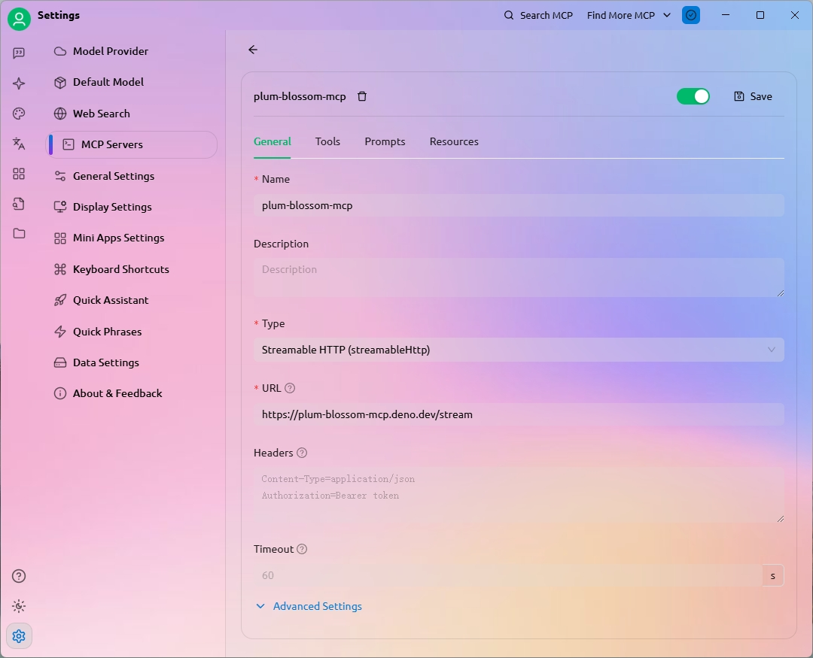
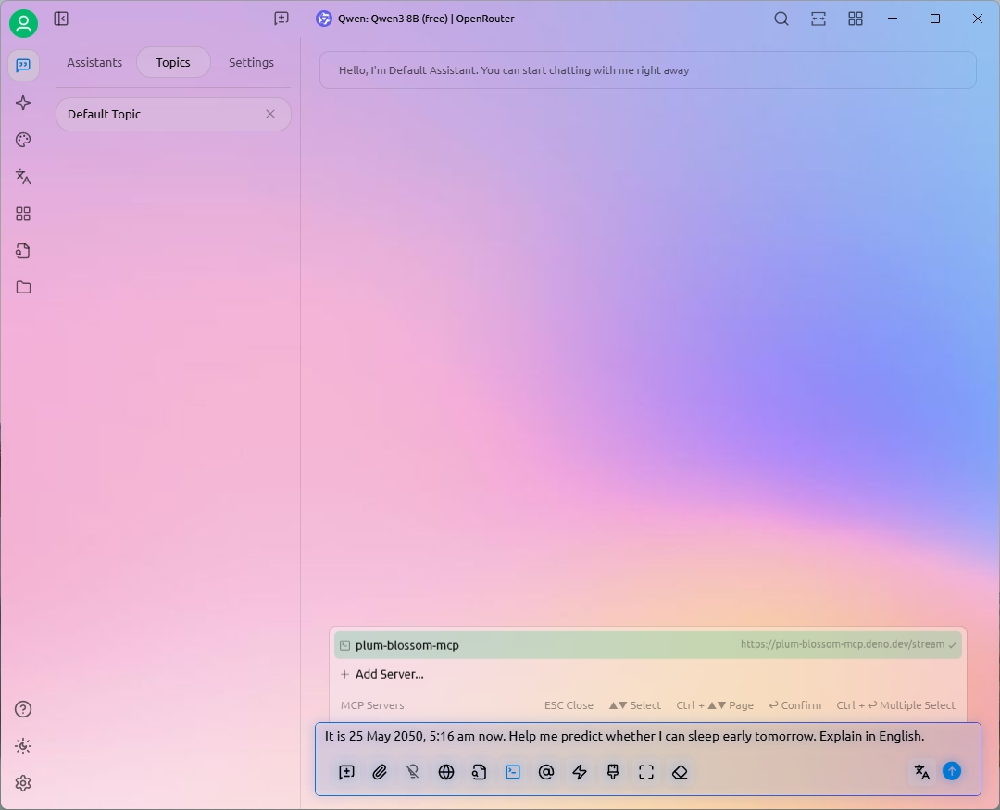
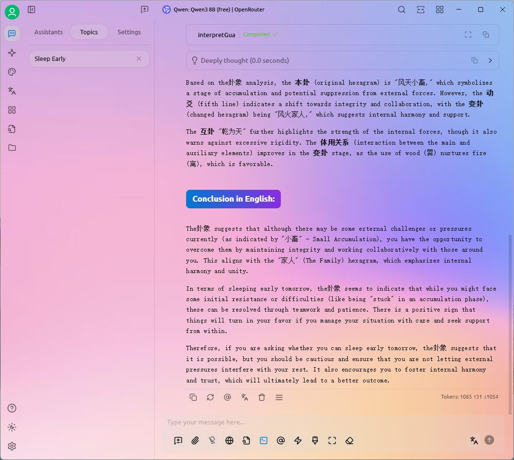

# plum-blossom-mcp

An MCP server that helps your agent perform plum blossom divination (梅花易数).

> [!NOTE]
> Note: This MCP server is based on streamable HTTP transport. Make sure your
> MCP host supports it, and set the MCP server URL as
> `https://plum-blossom-mcp.deno.dev/stream`

> [!CAUTION]
> This project/service is for research purposes only and is not intended as
> actual life guidance. We assume no direct or indirect liability for any
> damages caused by the use of this project/service.

> [!WARNING]
> The deployed MCP server is currently provided free of charge, but it is
> subject to change or removal at any time without notice. We do not guarantee
> its availability or reliability.

## Example on How to Use It in [Cherry Studio](https://github.com/CherryHQ/cherry-studio)

1. Add a new MCP server in Cherry Studio, give it a name, select _Streamable
   HTTP_ as the type, and set the URL to
   `https://plum-blossom-mcp.deno.dev/stream`.

   

2. Start a new chat, and select the MCP server you just added.

3. Type your question in the chat input, send it, and wait for your prediction!

